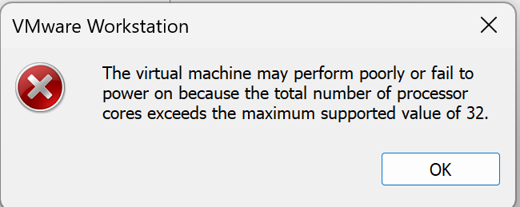
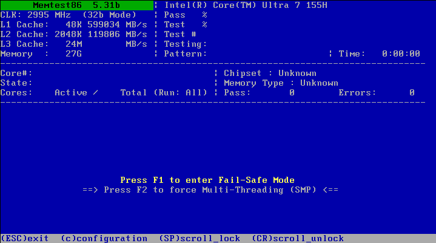
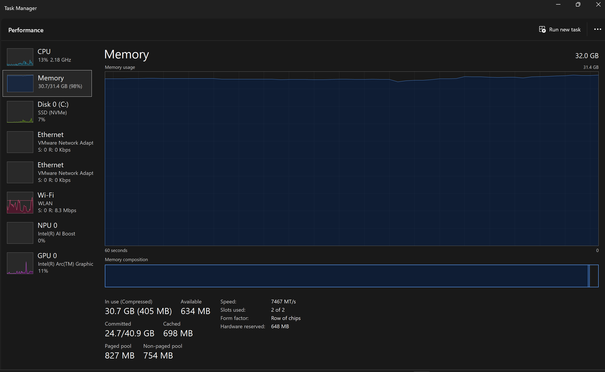
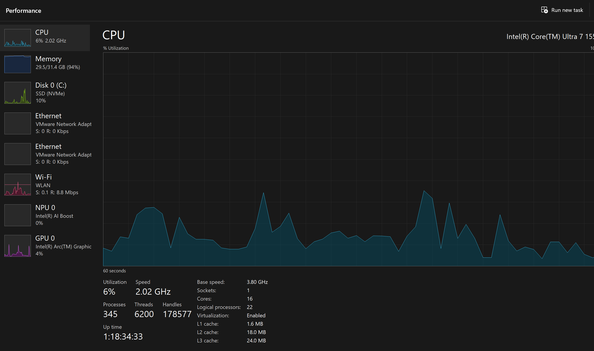

# KN01

## A) Hypervisor Typ 1 und 2

**Hypervisor**: Eine Software um mehrere VM’s auf einem physischen Gerät zu betreiben.

#### Hypervisor 1

Läuft direkt auf der Hardware ohne Schichten dazwischen

#### Hypervisor 2

Braucht ein OS um darauf zu laufen können und hosted selber einen Server für sich

## B) Virtualisierungssoftware

**_Vermutung_**: Unser Hypervisor ist **virtual box**, welches nach unserem Wissen auf dem OS lauft. Somit könnten wir gar nicht mehr RAM und logische Prozessoren zuweisen, als unser OS hat. Demnach glauben wir Typ 2.

Meldung wenn man versucht mehr RAM als zur verfügung zu aufstarten:

Memory Test:

Beim RAM konnte ich nicht mehr auswählen, als ich vom OS zur Verfügung hatte.

