# KN02: IaaS - Virtuelle Server

## Korrektur

Fehler:
C) Abgabe fehlt: Screenshot mit dem ssh-Befehl und des Resultats unter Verwendung des zweiten Schlüssels

--> Ihre Datei hat zu viele Rechte, darum der Fehler

Lösung:
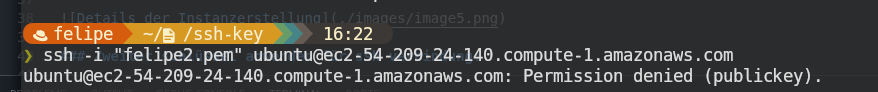

## A) Umgang mit AWS Kurs (20%)

Zu Beginn in AWS habe ich auf **Launch AWS Academy Learner Lab** geklickt. Dort kann ich mein Lab starten, sehe wie viel Zeit ich noch zur verfügung habe, kann meine Lab starten und stoppen und ich kann auch auf dem **AWS** mit dem grünen Punkt klicken, welches mich zu einer neuen Page führt

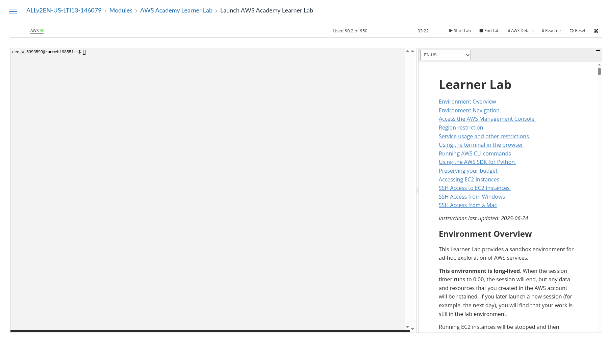

## B) Instanz erstellen (40%)

Bei der Instanzerstellung, habe ich meine Instanz KN02 gennant, es auf Ubuntu gestellt und setzte den Instanztyp als t3.micro

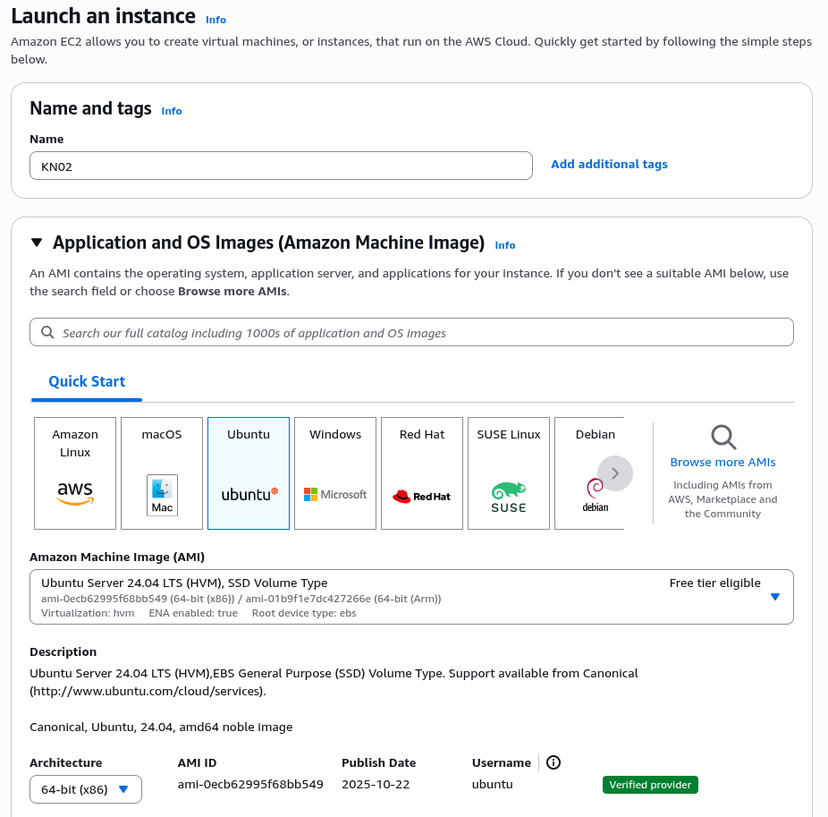

Danach muss ich noch ein Keypair erstellen und herunterladen, damit ich mich dann zur Instanz verbinden kann.

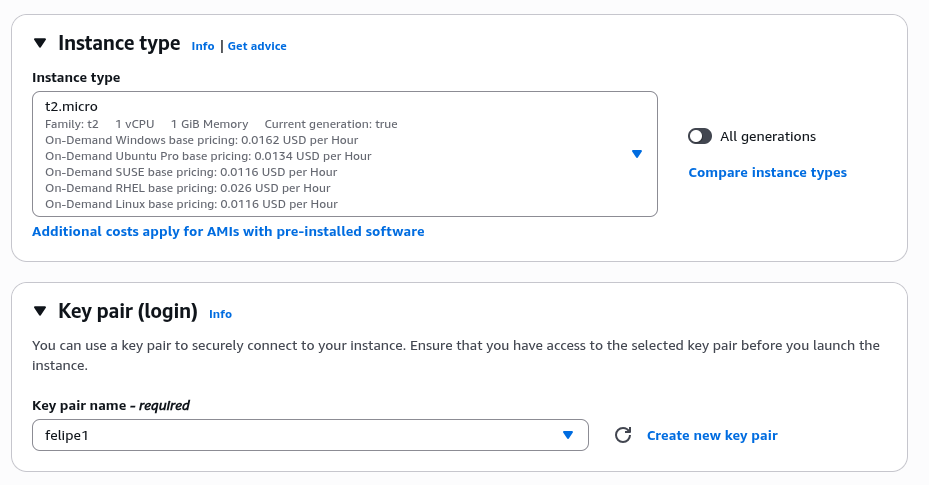

Dann wäre das das nötige und ich erstellte somit meine Instanz

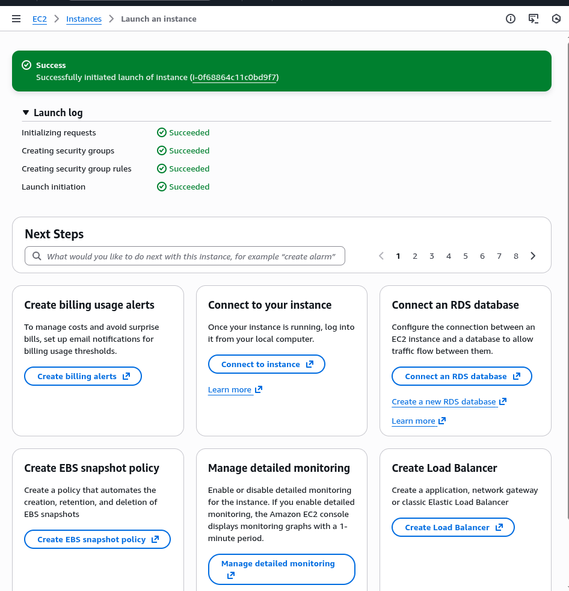
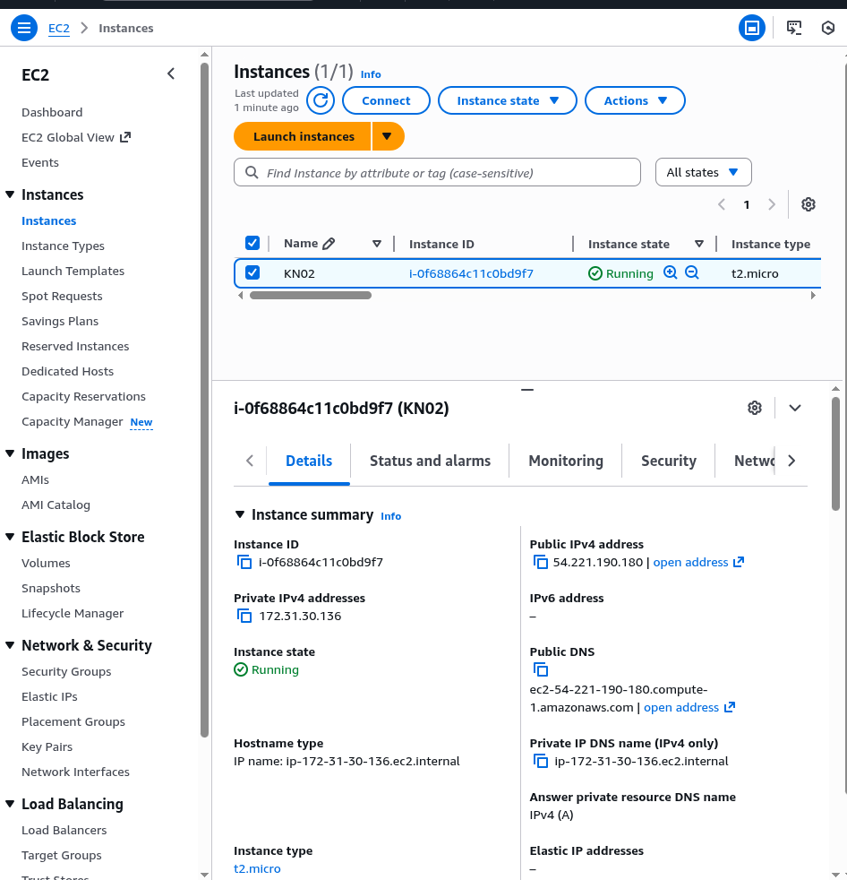

## C) Zugriff mit SSH-Key (40%)

Damit ich Zugriff auf meine Erstellte Instanz erstellen kann, muss man den generierten Schlüssel, den man heruntergeladen
hat(in meinem Fall felipe1.pem), zur verfügung haben und am besten im gleichen Pfad wie den Schlüssel die commands auszuführen.

Danach habe ich folgende commands in der Reihenfolge ausgeführt:

1. chmod 400 "felipe1.pem"
2. ssh -i "felipe1.pem" ubuntu@ec2-54-204-227-155.compute-1.amazonaws.com

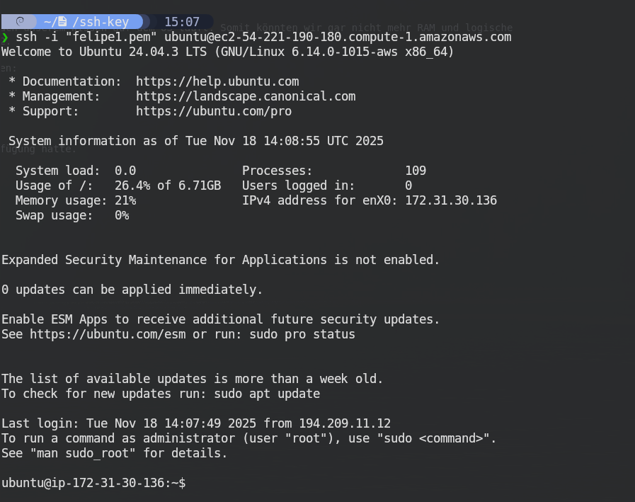

Diese commands habe ich in der AWS SSH-Connection gefunden und nachbefolgt.

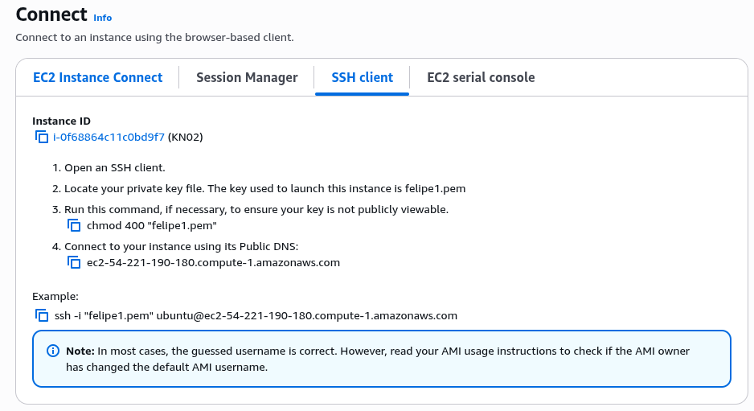

### Zweiter schlüssel anwenden für ssh verbindung:

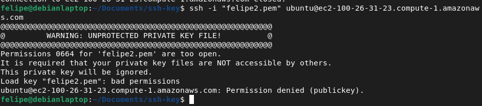

### Statistiken der Instanz

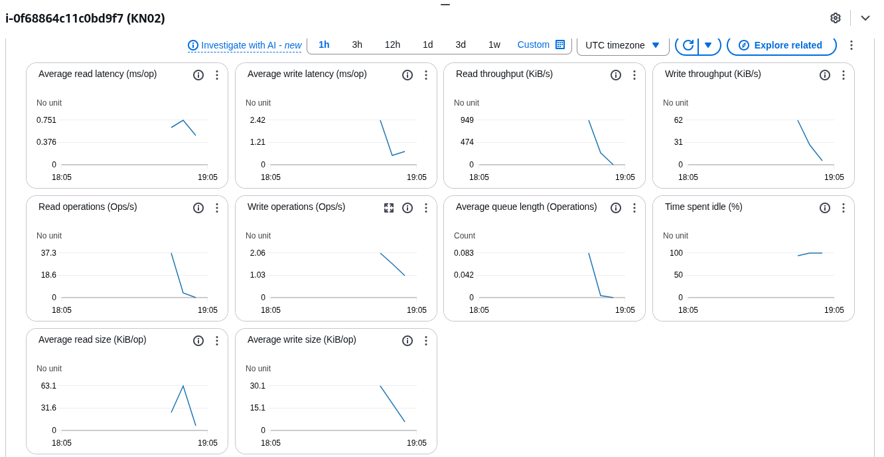

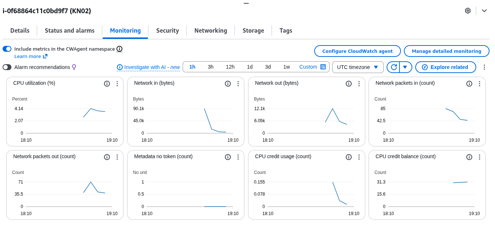
