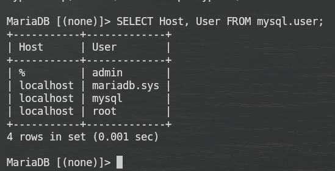

# KN 03

sudo mysql -sfu root -e "GRANT ALL ON _._ TO 'admin'@'%' IDENTIFIED BY 'Ubuntu' WITH GRANT OPTION;"

```bash
- sudo apt update
- sudo apt install apache2
- sudo apt install php
- sudo apt install libapache2-mod-php
- sudo apt install mariadb-server
- sudo apt install php-mysql
- sudo mysql -sfu root -e "GRANT ALL ON _._ TO 'admin'@'%' IDENTIFIED BY 'Ubuntu' WITH GRANT OPTION;"
- sudo systemctl restart mariadb.service
- sudo systemctl restart apache2
- cd ~
- git clone https://gitlab.com/ch-tbz-it/Stud/m346/m346scripts.git
- sudo nano ~/m346scripts/KN03/db.php
- ls
- cd m346scripts/
- ls
- cat README.md
- sudo cp ~/m346scripts/KN03/\*.php /var/www/html/
- cd KN03
- ls
- cat db.php
- mysql -u admin -p
```

Dann mit dem command **SELECT Host, User FROM mysql.user;** habe ich folgendes ausgeben lassen.


