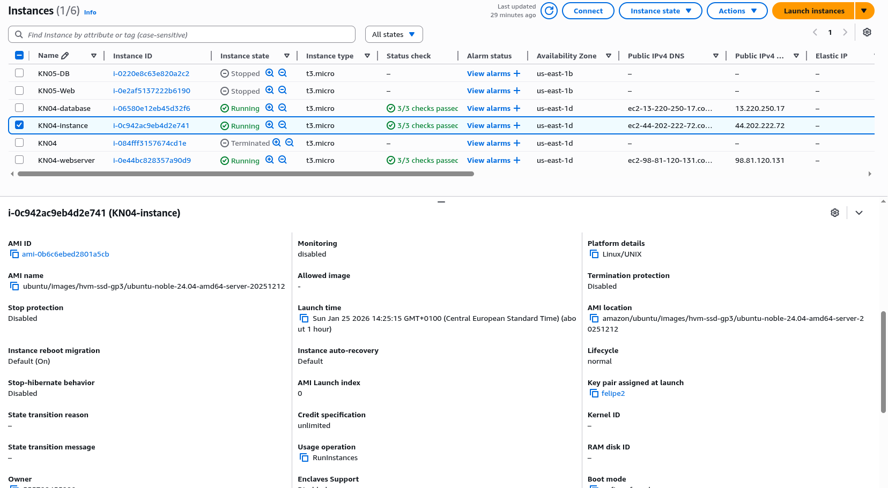
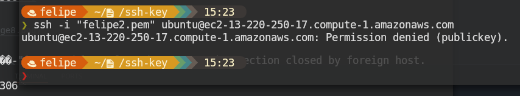
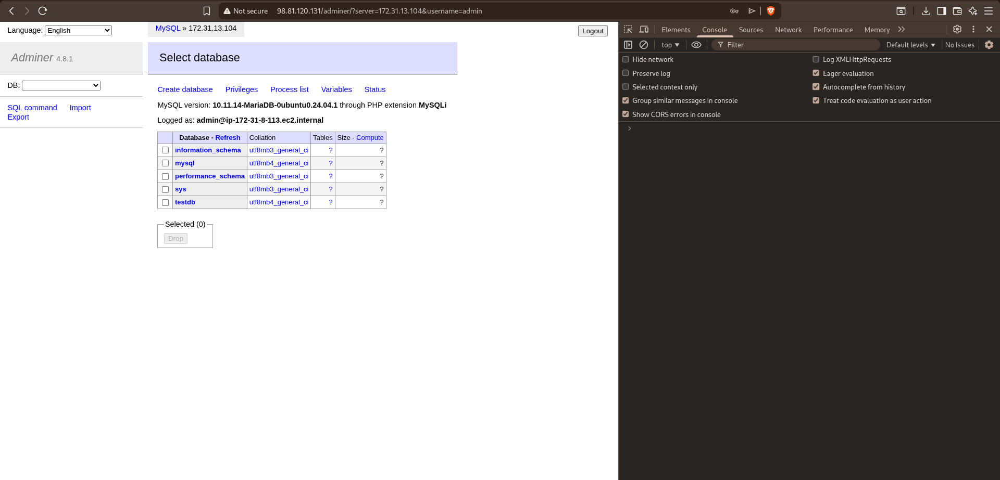
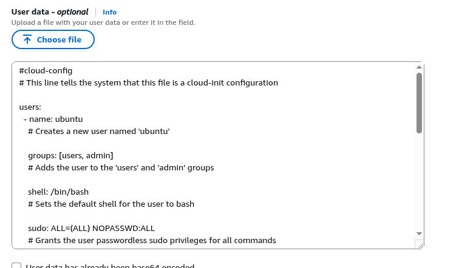
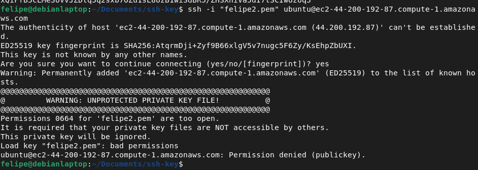
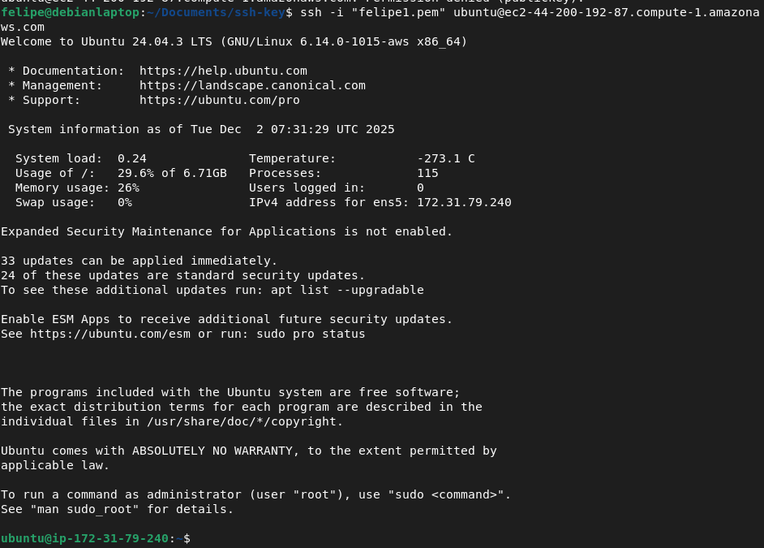
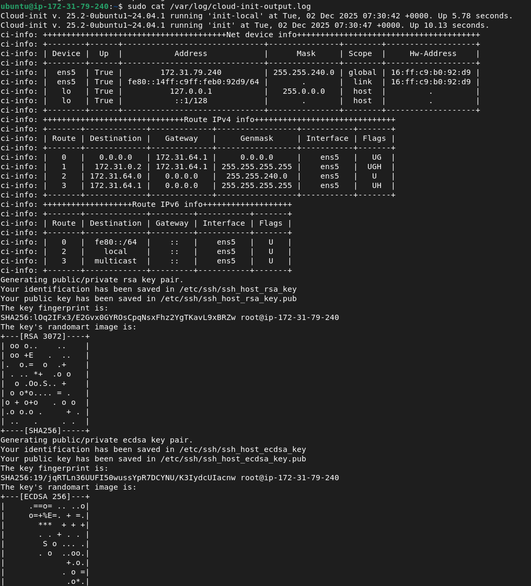
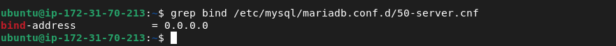
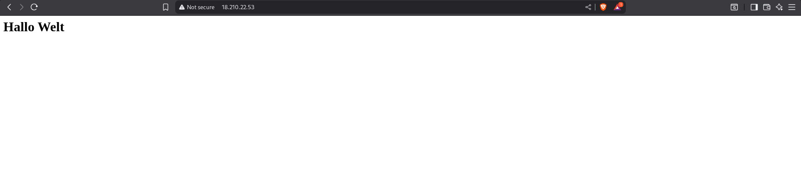
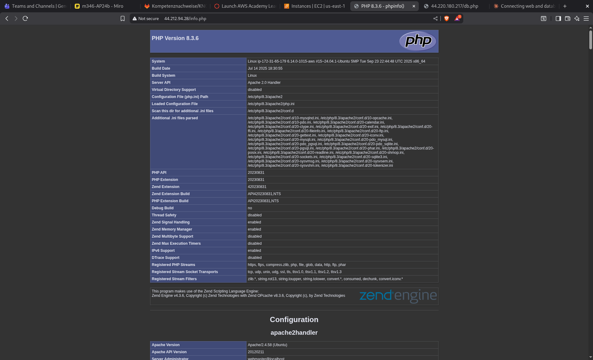

# KN04

## Korrektur

Fehler:
B) fehlt: Ein Screenshot der Details der Instanz. Scrollen Sie so weit runter, dass das Feld "Key pair assigned at launch", sichtbar ist.

B) Fehlermeldung bei ssh ist wegen ungeschütztem Key, nicht wegen server antwort.

C) wieso ist php-mysql am richtigen Ort?

C) für was ist die pipe in cloud-init |

C) wichtig: DB instanz löschen und neu erstellen ohne manuelle installation.

Fehlersuche: http://44.212.94.28/db.php (achtung öffentlich IP von Web server kann ändern). Mögliche Fehler:

falsche IP oder Credentials in db.php
Firewallprobleme (bei DB server)
DB server läuft nicht korrekt

Lösung:

Instanzerstellung mit init.yaml

login mit key 2

login mit key 1

Inhalt von /var/log/cloud-init-output.log

grep:

index.html von web:

db.php von der db:

info.php auf der web:

