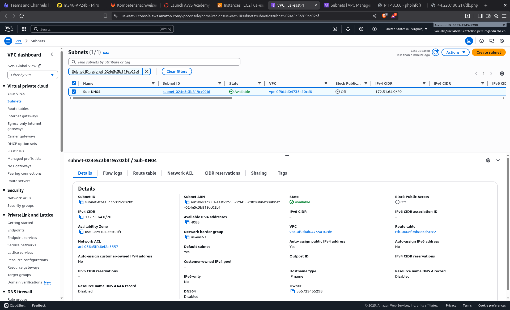
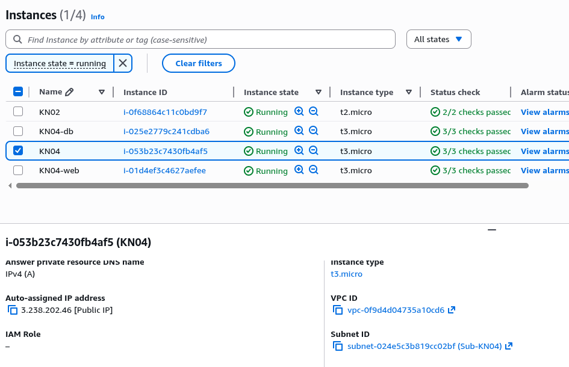

# KN05

VPC: Ein eigenes, isoliertes Netzwerk in AWS, in dem deine Server laufen.
Subnet: Ein Teilbereich der VPC. Es teilt das Netzwerk in kleinere Zonen.
Private IP: Nur intern in AWS erreichbar. Nicht über das Internet sichtbar.
Public IP: Eine IP, über die man den Server aus dem Internet erreichen kann.
Static IP (Elastic IP): Eine öffentliche IP, die immer gleich bleibt – auch nach einem Neustart.

Subnet of KN04

Private IP:
Webserver: 10.0.2.10
Datenbank: 10.0.2.20

(Regeln: im Bereich des Subnet-KN05 und letzte Zahl durch 10 teilbar)
