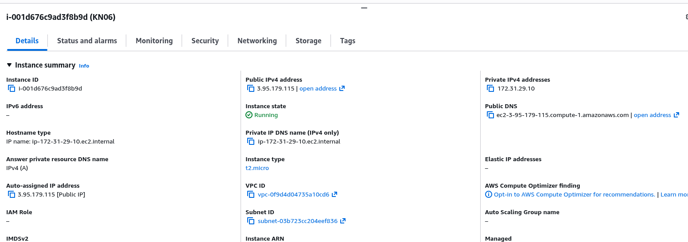
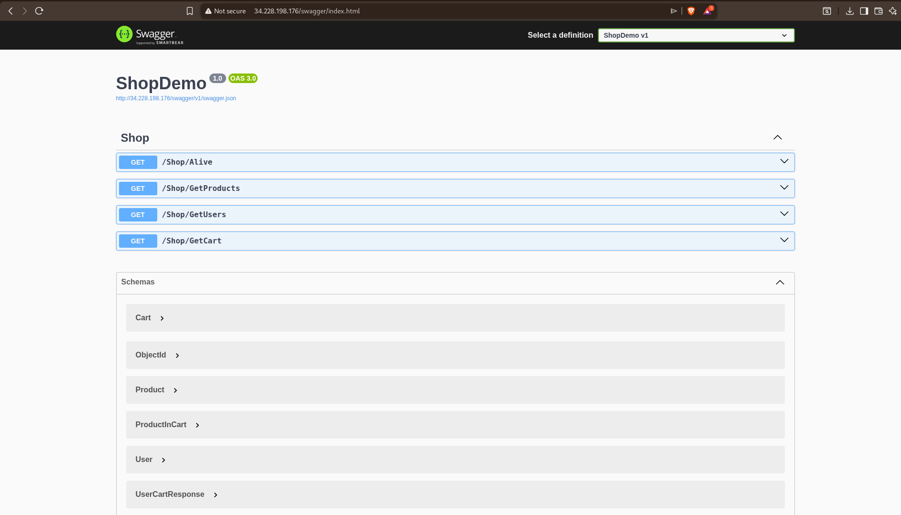
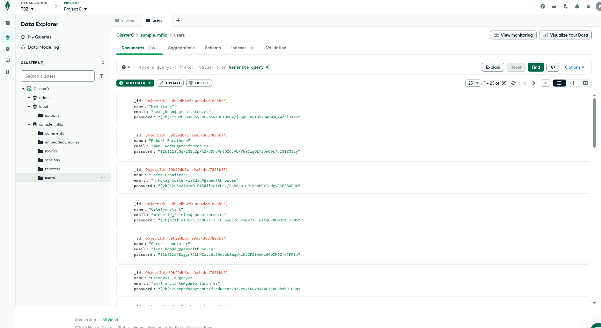
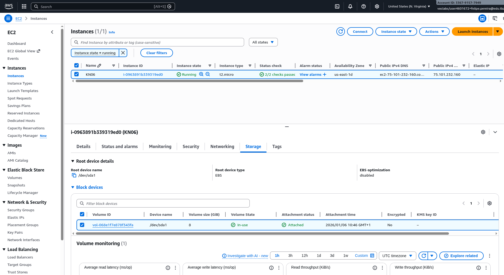
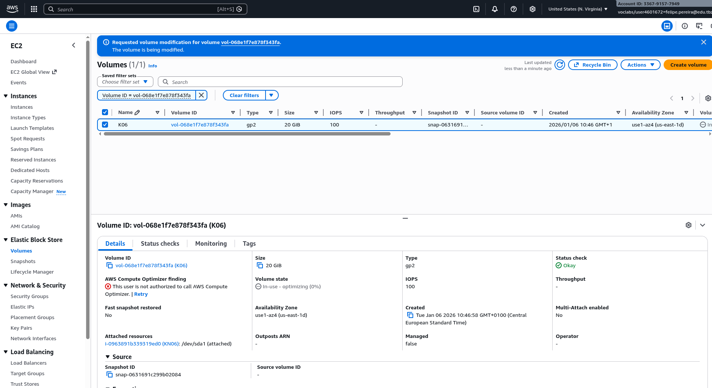

# KN06

## Korrektur

Fehler:
.NET App läuft nicht, weil im cloud-init die Werte noch falsch ersetzt werden.

Sicherstellen, dass alle teile laufen (Load Balancer, Target Groups, Auto Scaler)

Lösung:

mongodb.com details:
user: felipepereira_db_user
password: Qv7lJ7y5Kc2lBRT8

mongodb driver: mongodb+srv://felipepereira_db_user:<Qv7lJ7y5Kc2lBRT8>@kn06.b4p33n6.mongodb.net/?appName=KN06

um volumen zu vergrösern, auf die instanz klicken / wählen, zu volumen tab wechseln, auf die volumen id klicken, rechts klick auf das volumen und dann volumen grösse anpassen.

