# KN07

db passwort: AdminPassword
db connect: mariadb -h kn07-mariadb.cdiisxkgaa8h.us-east-1.rds.amazonaws.com -P 3306 -u admin -p

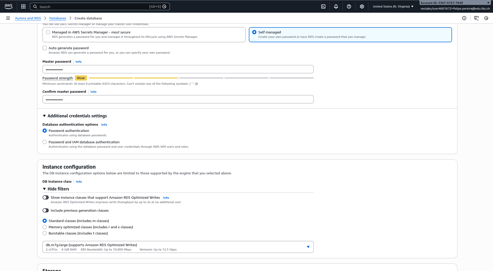
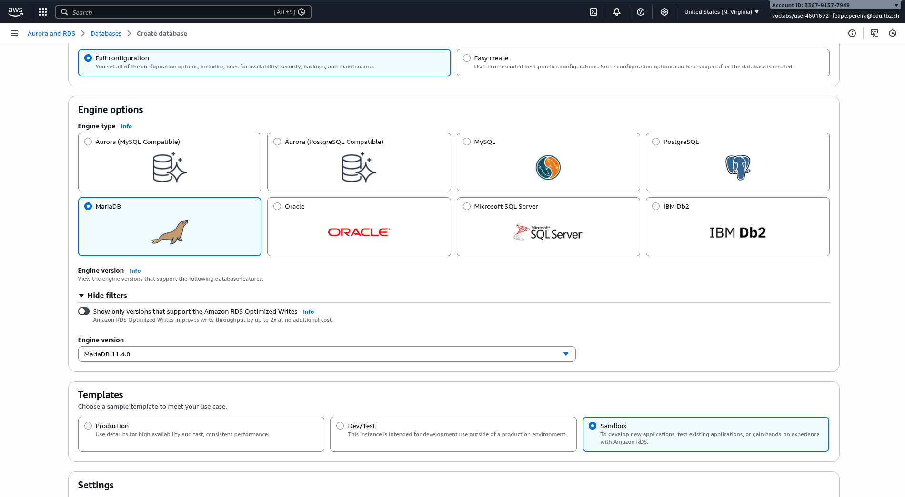
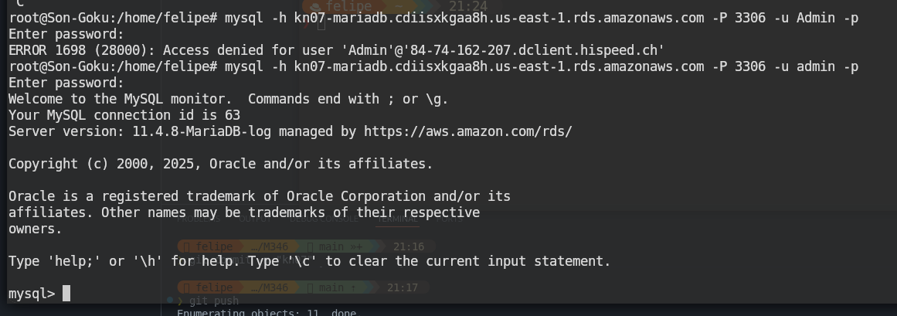

```
CREATE DATABASE IF NOT EXISTS testdb;
USE testdb;

CREATE TABLE IF NOT EXISTS products (
    id INT AUTO_INCREMENT PRIMARY KEY,
    name VARCHAR(100),
    price DECIMAL(10,2)
);

INSERT INTO products (name, price) VALUES
('Laptop', 999.99),
('Mouse', 29.99),
('Keyboard', 49.99);

SELECT * FROM products;
```

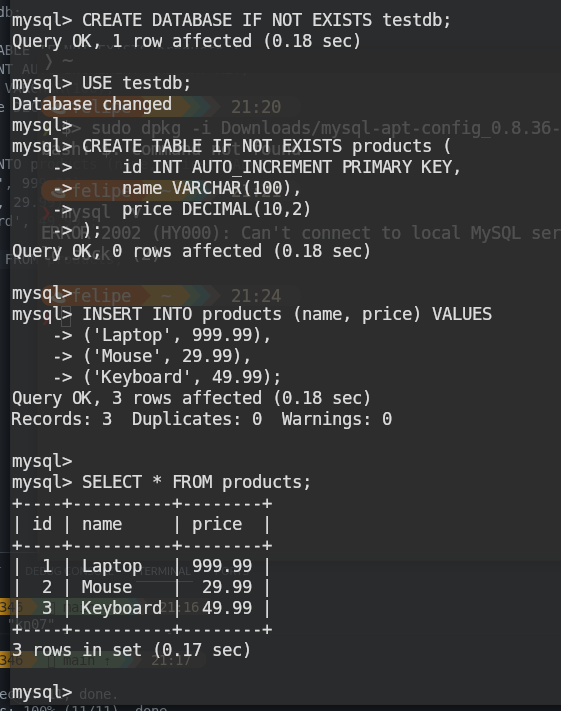

application:
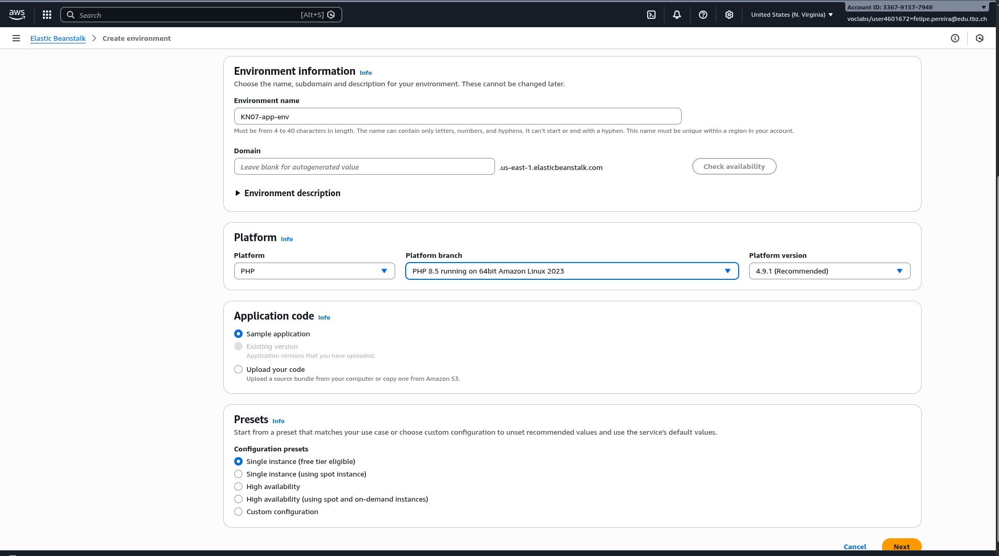
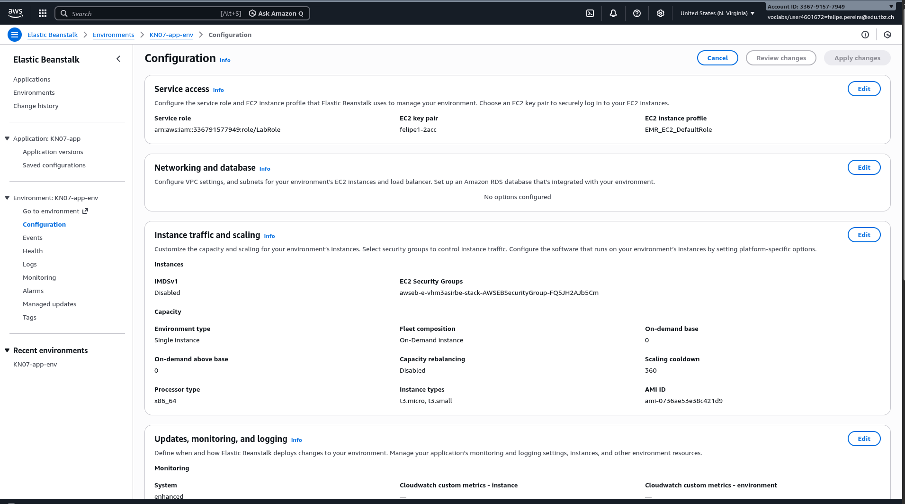
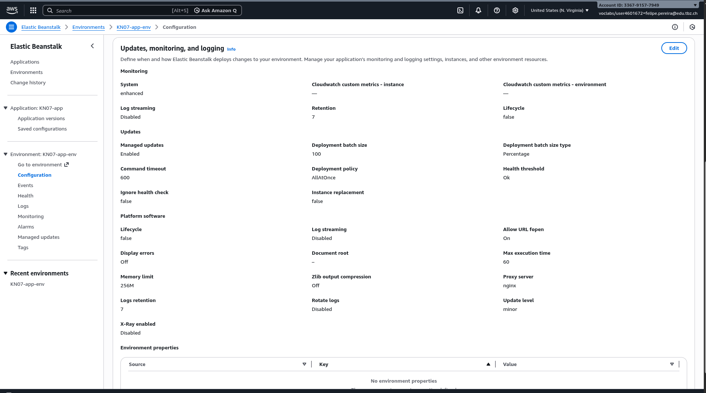

Ressourcen/Objekte:

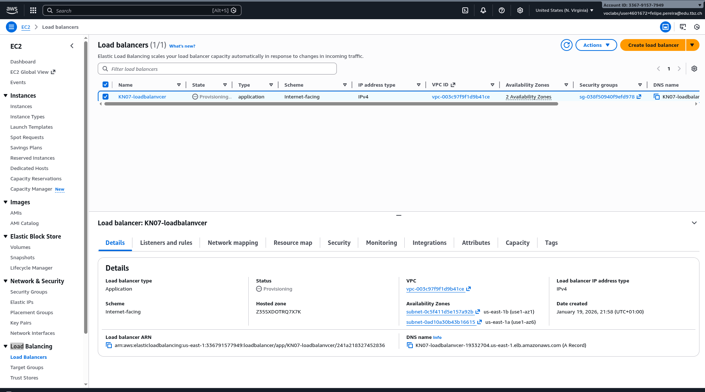
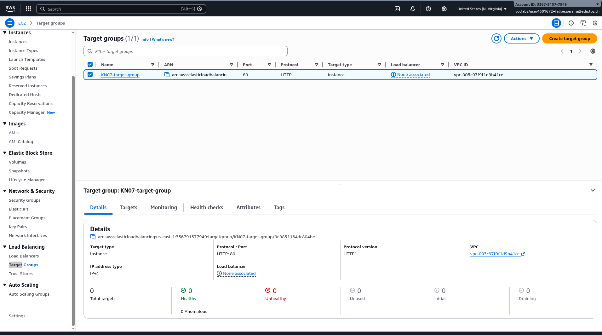
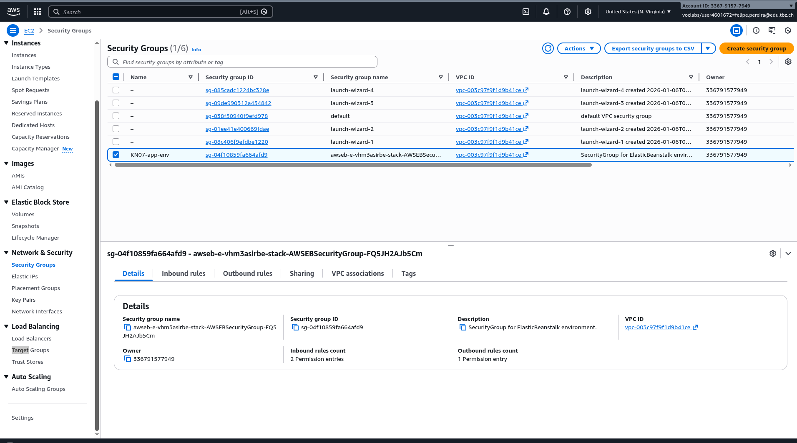
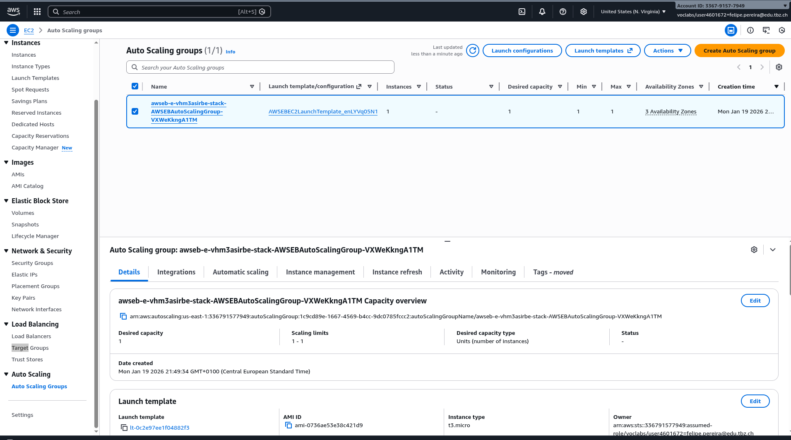

CloudFormation ist Infrastructure as Code (IaC) - ein AWS Service der 
Infrastruktur mit Templates (YAML/JSON) beschreibt. Beim Deployment 
erstellt AWS automatisch alle definierten Ressourcen (EC2, Load Balancer, 
Security Groups etc.) als einen zusammenhängenden Stack. 

Unterschied zu Cloud-Init:
- CloudFormation: Erstellt und orchestriert MEHRERE AWS Ressourcen 
  (komplette Infrastruktur)
- Cloud-Init: Konfiguriert nur EINE einzelne EC2 Instanz nach dem 
  Booten (User Data Script)

CloudFormation = Infrastruktur-Ebene
Cloud-Init = Instanz-Ebene

In KN06 mussten wir MANUELL erstellen:
- Load Balancer konfigurieren
- Target Groups erstellen
- Auto Scaling Groups einrichten
- Security Groups einzeln anpassen
- Jede Komponente separat verknüpfen

Mit Elastic Beanstalk (PAAS):
- Alles wurde AUTOMATISCH via CloudFormation erstellt
- Konsistente Configuration ohne Fehler
- Viel schneller (Minuten statt Stunden)
- Infrastructure as Code - wiederholbar und versionierbar