# KN10: Kostenberechnung - Cloud Migration CRM System

**Student:** Felipe  
**Klasse:** AP24b  
**Datum:** 06.01.2026

---

## Inhaltsverzeichnis

1. [Ausgangslage](#ausgangslage)
2. [Teil A: IaaS - Rehosting (AWS & Azure)](#teil-a-iaas---rehosting)
3. [Teil B: PaaS - Replattforming (Heroku)](#teil-b-paas---replattforming)
4. [Teil C: SaaS - Repurchasing (Zoho & Salesforce)](#teil-c-saas---repurchasing)
5. [Teil D: Interpretation der Resultate](#teil-d-interpretation-der-resultate)

---

## Ausgangslage

Unsere Firma betreibt aktuell ein eigenes CRM-System On-Premise mit folgender Infrastruktur:

**Web Server:**

- 1 CPU Core
- 2 GB RAM
- 20 GB Storage
- Betriebssystem: Ubuntu

**Datenbank Server:**

- 2 CPU Cores
- 4 GB RAM
- 100 GB Storage
- Betriebssystem: Ubuntu

**Backup-Strategie:**

- Tägliche Backups für 7 Tage
- Wöchentliche Backups für 1 Monat (4 Wochen)
- Monatliche Backups für 3 Monate
- **Geschätzte Backup-Größe gesamt:** ca. 1400 GB
  - Berechnung: (7 × 100 GB) + (4 × 100 GB) + (3 × 100 GB) = 1400 GB

**Anzahl Benutzer:** 30 aktive Nutzer

Die Firma evaluiert nun verschiedene Cloud-Migrationsoptionen, um Kosten zu reduzieren und Flexibilität zu erhöhen.

---

## Teil A: IaaS - Rehosting

### AWS Kostenrechnung

**AWS Pricing Calculator - Verwendete Komponenten:**

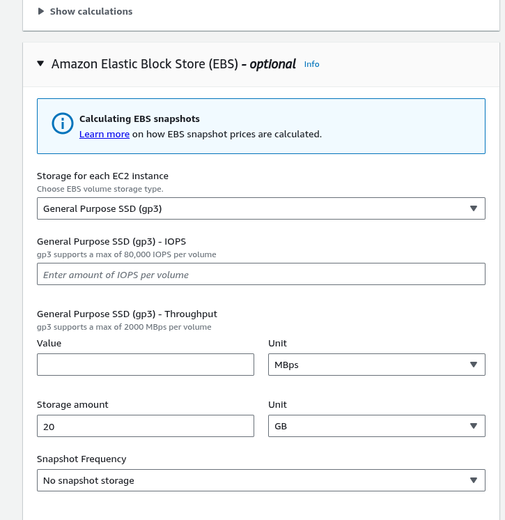

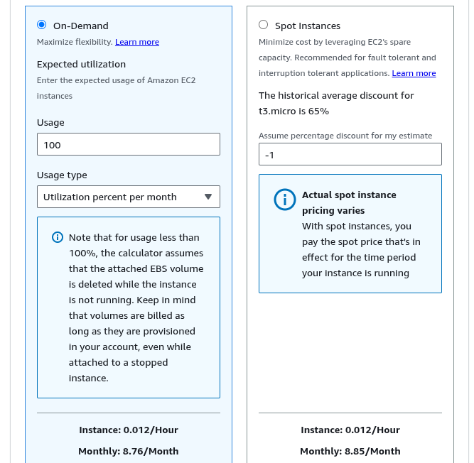
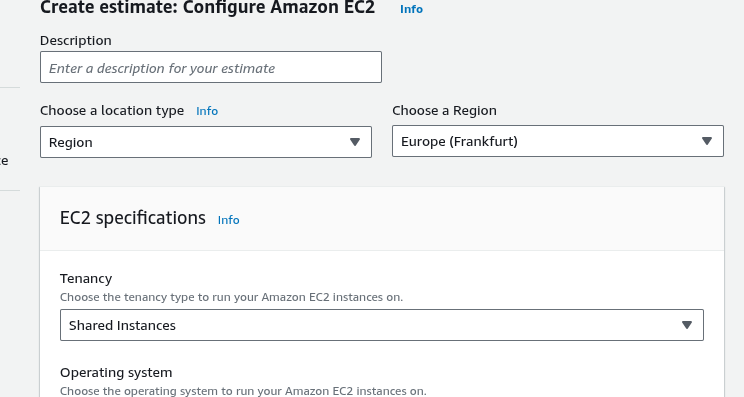
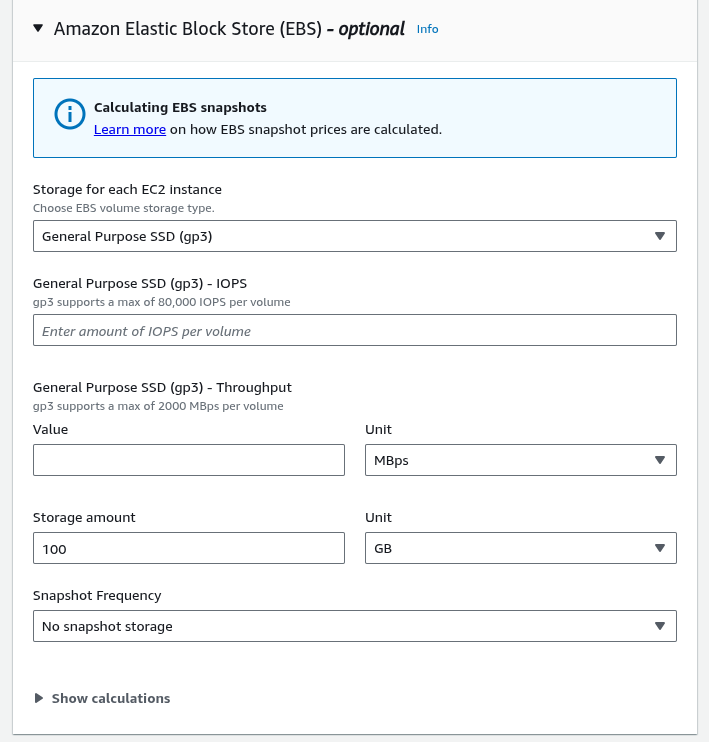
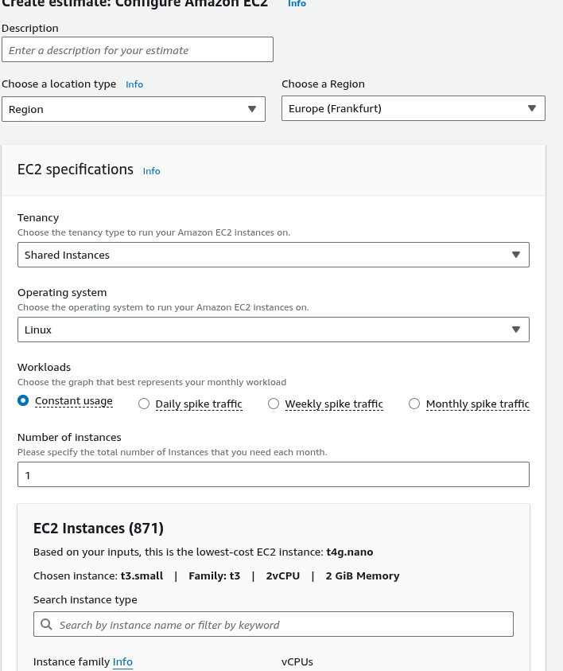
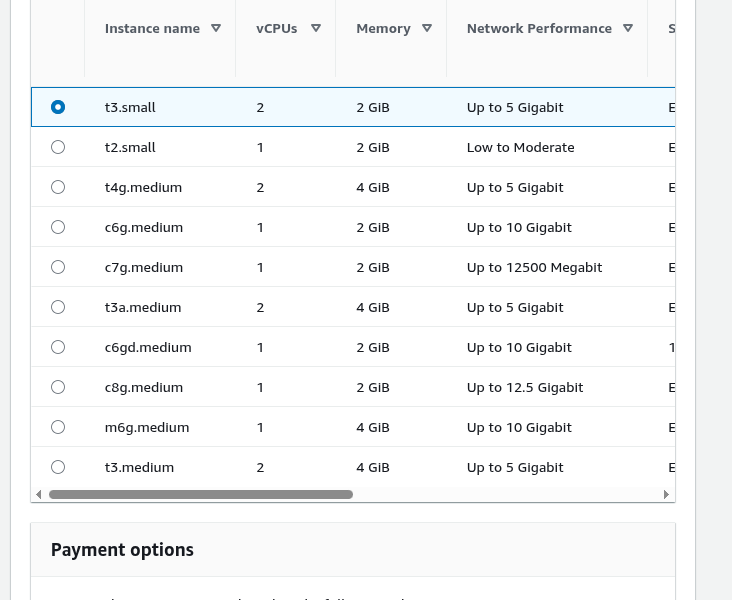
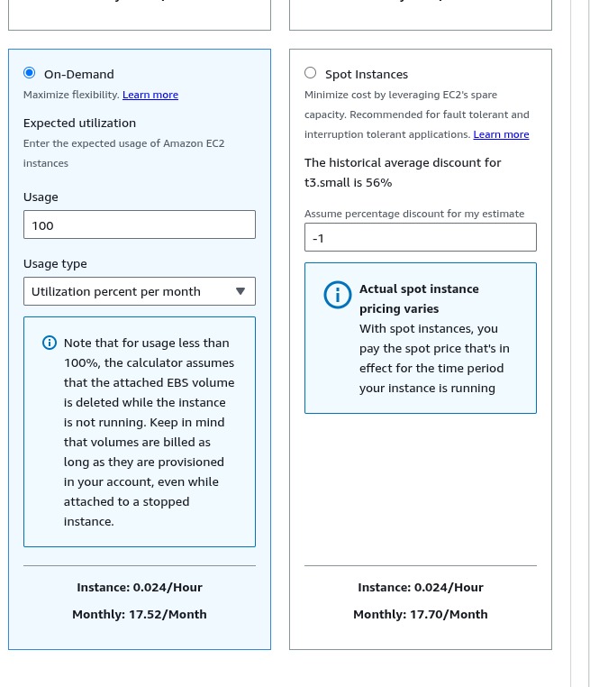
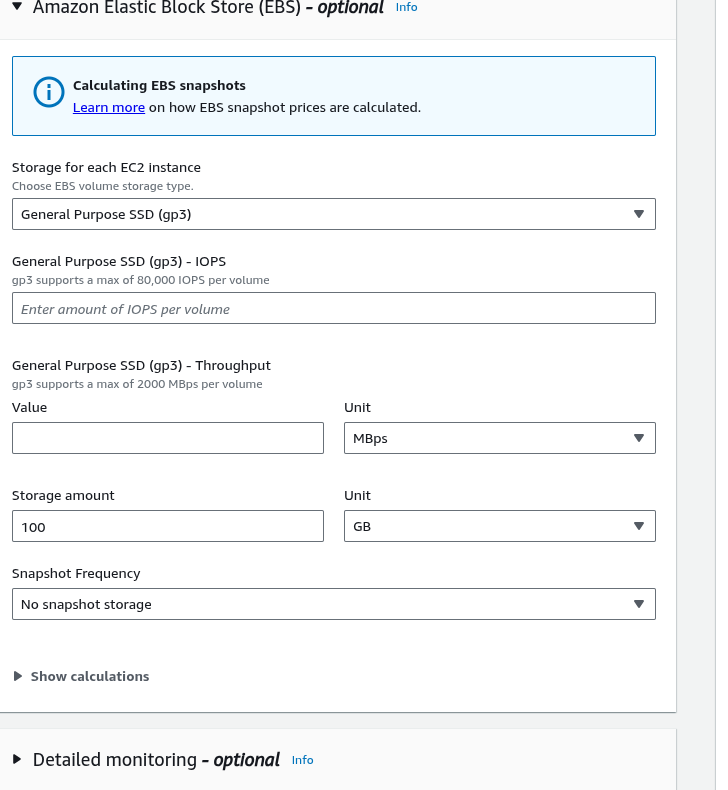
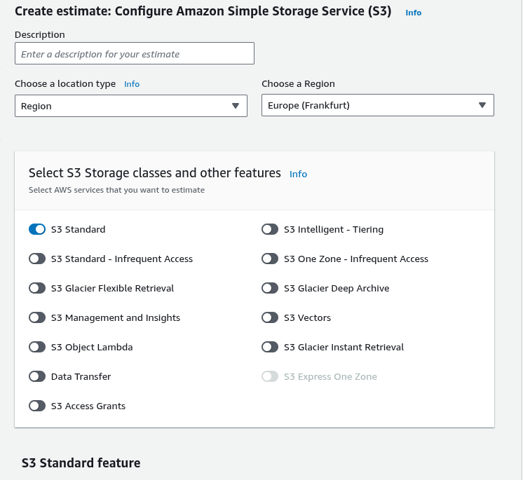
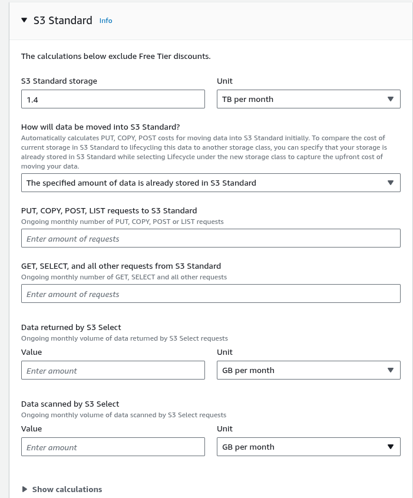
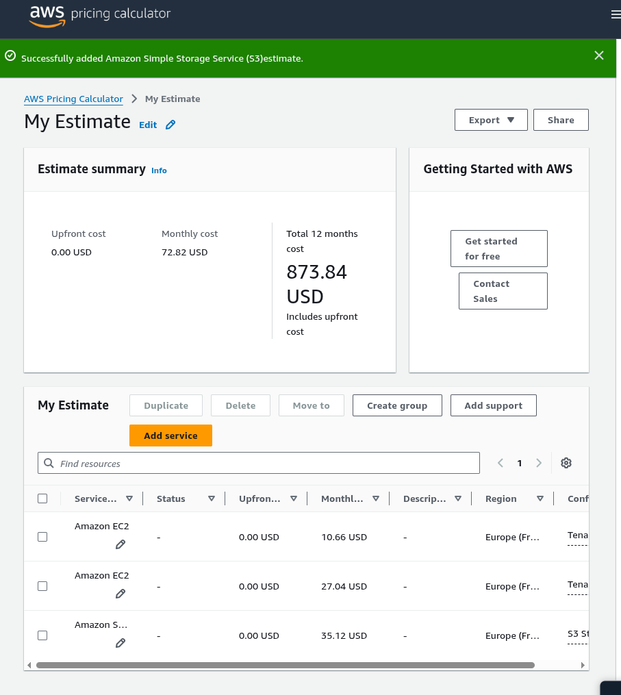

#### Gewählte AWS Komponenten:

**1. Web Server - Amazon EC2 Instance**

- **Instance Type:** t3.micro
- **Spezifikationen:** 1 vCPU, 1 GB RAM
- **Storage:** 20 GB General Purpose SSD (gp3)
- **Betriebssystem:** Linux/Ubuntu
- **Anzahl:** 1 Instance
- **Geschätzte Kosten:** ca. $7-8/Monat

**2. Datenbank Server - Amazon EC2 Instance**

- **Instance Type:** t3.small
- **Spezifikationen:** 2 vCPUs, 2 GB RAM
- **Storage:** 100 GB General Purpose SSD (gp3)
- **Betriebssystem:** Linux/Ubuntu
- **Anzahl:** 1 Instance
- **Geschätzte Kosten:** ca. $15-17/Monat

**3. Backup Storage - Amazon S3**

- **Storage Class:** S3 Standard
- **Kapazität:** 1400 GB (1.4 TB)
- **Geschätzte Kosten:** ca. $30-32/Monat

**Gesamtkosten AWS:** ca. **$52-57 pro Monat** (ca. **$624-684 pro Jahr**)

#### Erklärung der Komponentenwahl AWS:

**Web Server (t3.micro):**
Die t3.micro Instance bietet eine gute Balance zwischen Kosten und Performance für unsere Anforderungen. Mit 1 vCPU und 1 GB RAM ist sie etwas schwächer als die On-Premise Variante (2 GB RAM), aber für einen Web-Server mit 30 Benutzern durchaus ausreichend. Die t3-Serie bietet "burstable performance", was bedeutet, dass bei Lastspitzen temporär mehr CPU-Power verfügbar ist. Falls die Performance nicht reichen sollte, kann man problemlos auf t3.small upgraden.

**Datenbank Server (t3.small):**
Hier habe ich bewusst den RAM von 4 GB auf 2 GB reduziert, um Kosten zu sparen. Die t3.small Instance ist für eine CRM-Datenbank mit 30 Benutzern meistens ausreichend. Cloud-Datenbanken sind oft effizienter als On-Premise Lösungen. Der große Vorteil: Sollte die Performance nicht ausreichen, kann man innerhalb weniger Minuten auf eine größere Instance (z.B. t3.medium mit 4 GB RAM) wechseln, ohne große Migration.

**Storage (gp3 SSD):**
Ich habe gp3 SSDs statt gp2 gewählt, weil sie ein besseres Preis-Leistungs-Verhältnis bieten. SSDs sind schneller als die vermutlich On-Premise verwendeten HDDs, was die Datenbankperformance verbessert.

**Backup Storage (S3 Standard):**
S3 ist perfekt für Backups geeignet. Der große Vorteil: Die Daten werden automatisch über mehrere Rechenzentren repliziert (hohe Verfügbarkeit). Man könnte die Kosten weiter senken, indem man ältere Backups automatisch in S3 Glacier (Archiv-Storage) verschiebt - das würde die monatlichen Kosten um 50-70% reduzieren.

**Abweichungen zur On-Premise Infrastruktur:**

- RAM reduziert (DB: 4 GB → 2 GB, Web: 2 GB → 1 GB): Cloud-Effizienz + Skalierbarkeit bei Bedarf
- SSD statt HDD: Bessere Performance
- Backup-Management vereinfacht durch S3 Lifecycle Policies
- Keine Hardware-Wartung nötig

---

### Azure Kostenrechnung

**Azure Pricing Calculator - Verwendete Komponenten:**

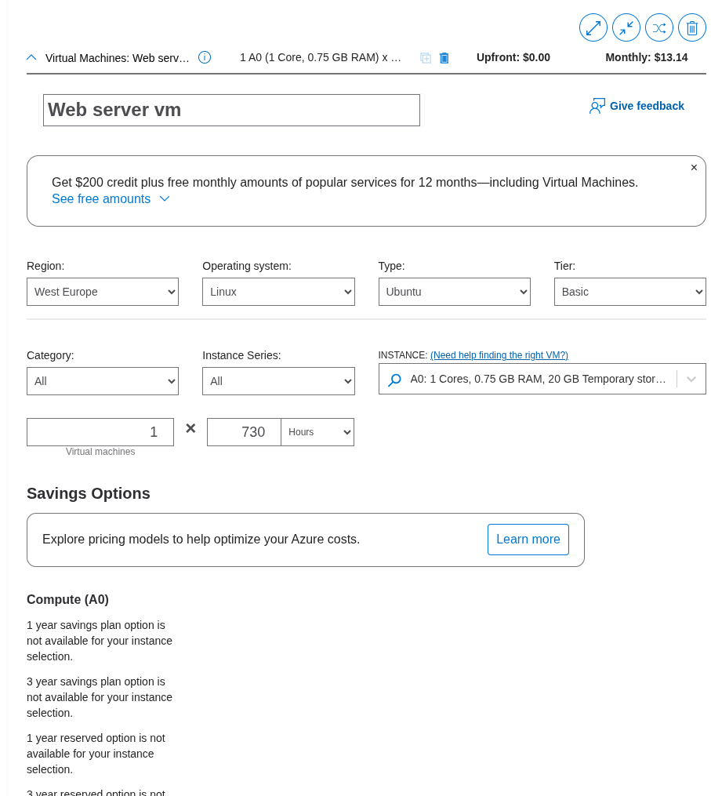
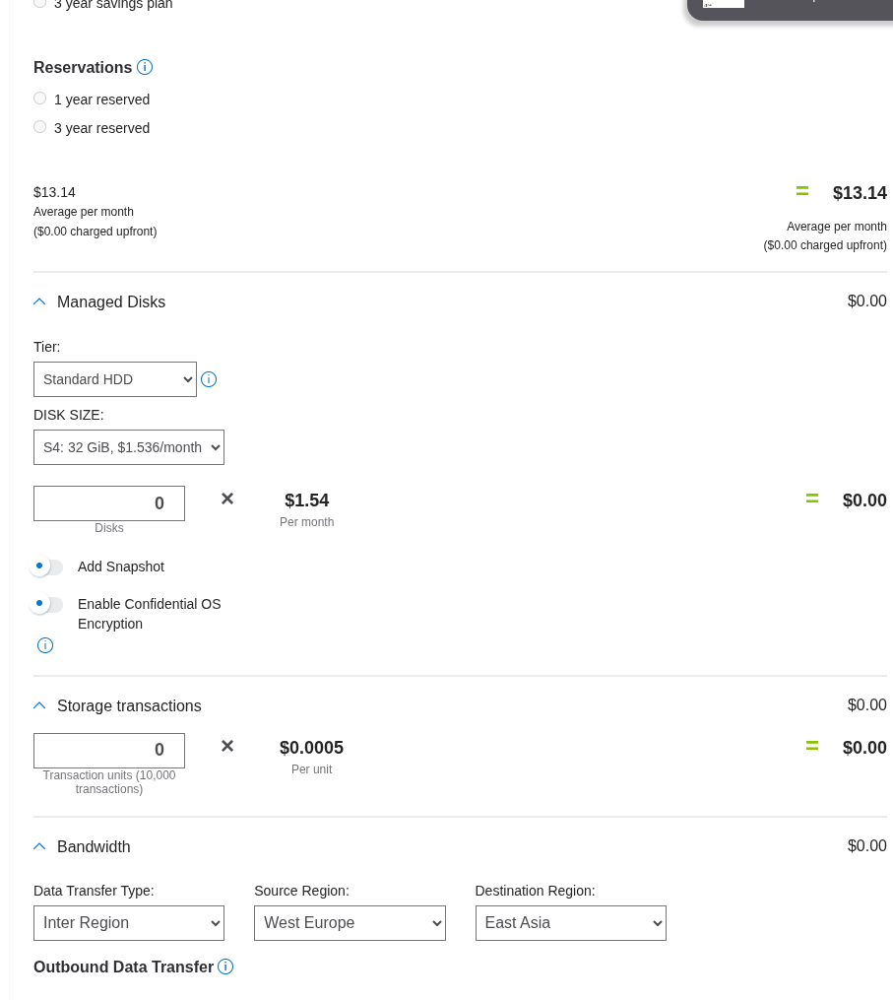
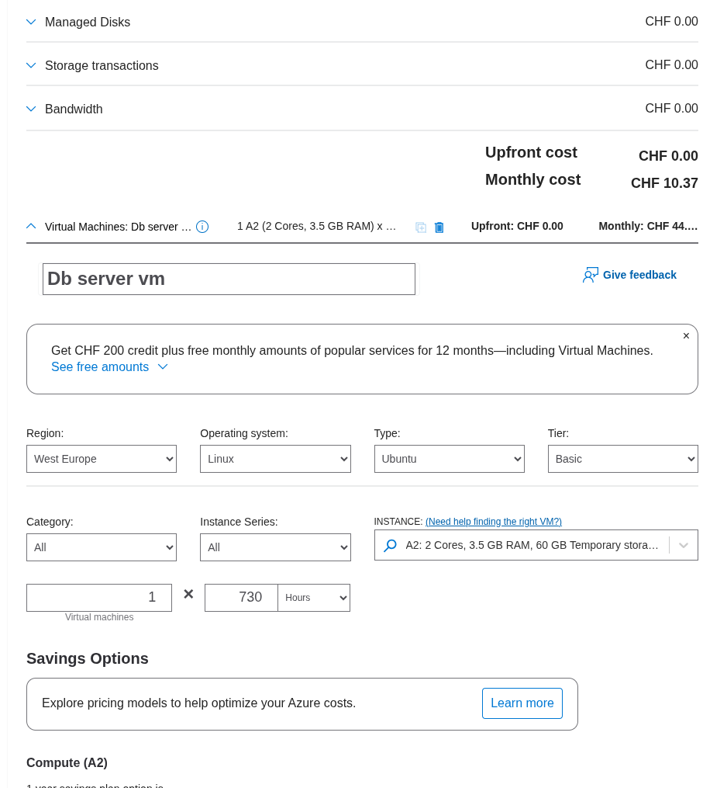
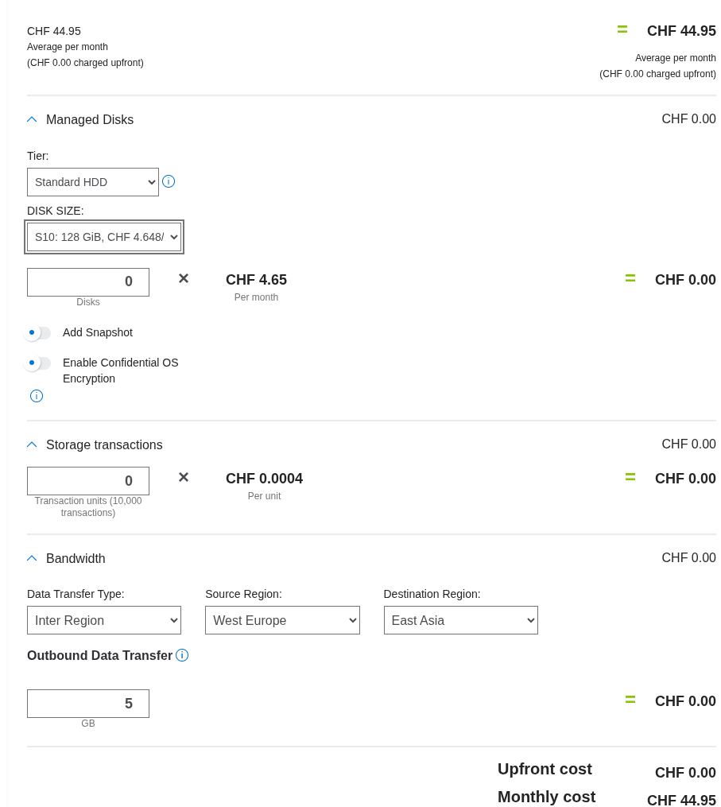
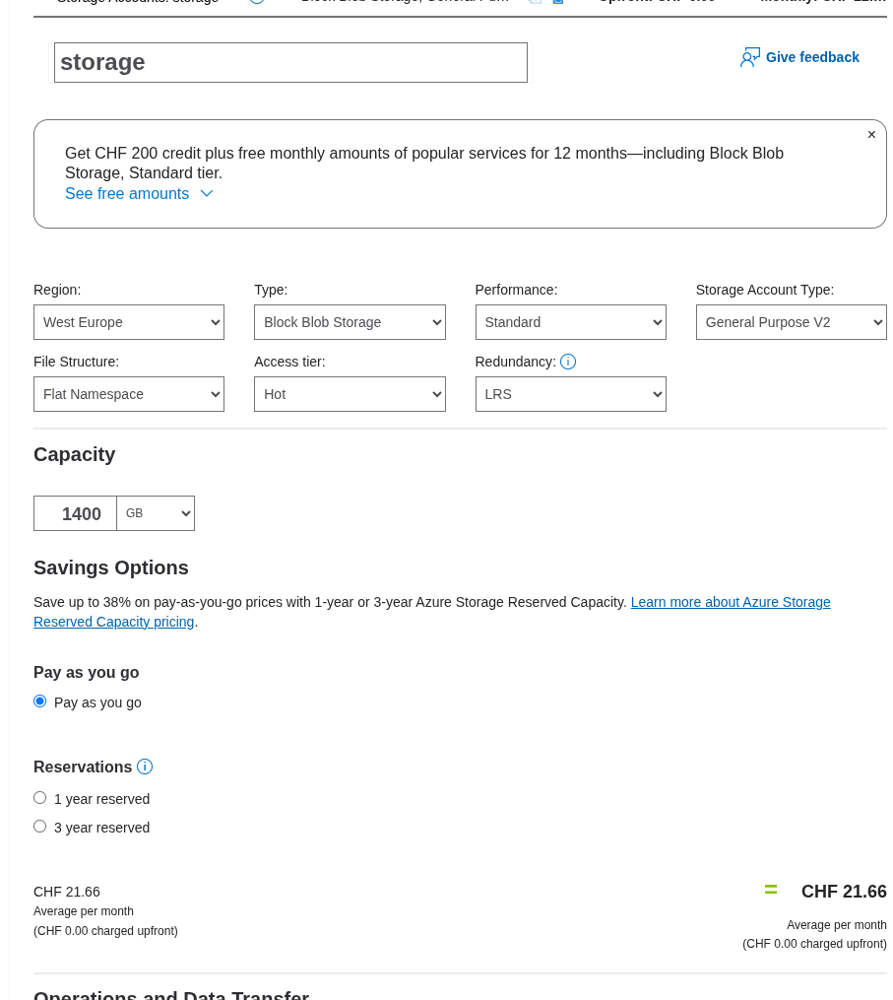

#### Gewählte Azure Komponenten:

**1. Web Server - Azure Virtual Machine**

- **VM Size:** B1s
- **Spezifikationen:** 1 vCPU, 1 GB RAM
- **Storage:** 20 GB Standard HDD
- **Betriebssystem:** Linux/Ubuntu
- **Anzahl:** 1 VM
- **Geschätzte Kosten:** ca. $9-10/Monat

**2. Datenbank Server - Azure Virtual Machine**

- **VM Size:** B2s
- **Spezifikationen:** 2 vCPUs, 4 GB RAM
- **Storage:** 100 GB Standard HDD
- **Betriebssystem:** Linux/Ubuntu
- **Anzahl:** 1 VM
- **Geschätzte Kosten:** ca. $38-40/Monat

**3. Backup Storage - Azure Blob Storage**

- **Storage Type:** Block Blob Storage
- **Tier:** Hot (frequently accessed)
- **Redundancy:** LRS (Locally Redundant Storage)
- **Kapazität:** 1400 GB
- **Geschätzte Kosten:** ca. $28-30/Monat

**Gesamtkosten Azure:** ca. **$75-80 pro Monat** (ca. **$900-960 pro Jahr**)

#### Erklärung der Komponentenwahl Azure:

**Web Server (B1s):**
Die B-Serie in Azure ist für "burstable" Workloads optimiert - ähnlich wie die t3-Serie bei AWS. Die B1s VM ist ideal für Web-Anwendungen, die nicht konstant hohe CPU-Last haben. Mit 1 vCPU und 1 GB RAM entspricht sie ungefähr der AWS t3.micro.

**Datenbank Server (B2s):**
Bei Azure habe ich mich entschieden, die vollen 4 GB RAM beizubehalten (wie On-Premise), weil der Preisunterschied zu einer kleineren VM nicht so groß ist. Das gibt uns mehr Sicherheit, dass die Performance ausreichend ist. Die B2s ist mit 2 vCPUs und 4 GB RAM eine solide Wahl für eine Datenbank mit 30 Benutzern.

**Storage (Standard HDD):**
Um Kosten zu sparen, habe ich Standard HDD statt Premium SSD gewählt. Für ein CRM-System mit 30 Benutzern reicht die Performance von HDDs normalerweise aus. Falls mehr IOPS benötigt werden, kann man später auf Premium SSD upgraden.

**Backup Storage (Blob Storage Hot Tier):**
Der "Hot Tier" ist für Daten gedacht, auf die häufig zugegriffen wird. Da wir bei Backups regelmäßig auf die Daten zugreifen könnten (Testing, Restore), ist der Hot Tier eine gute Wahl. LRS (Locally Redundant Storage) bedeutet, dass die Daten dreimal innerhalb eines Rechenzentrums gespeichert werden - für Backups ausreichend.

**Abweichungen zur On-Premise Infrastruktur:**

- Web Server RAM gleichbleibend bei 1 GB (On-Premise hatte 2 GB, aber wahrscheinlich nicht voll genutzt)
- DB Server RAM beibehalten bei 4 GB (identisch zu On-Premise)
- HDD statt SSD zur Kostenoptimierung
- Höhere Verfügbarkeit durch Cloud-Infrastruktur ohne zusätzliche Kosten

**Vergleich AWS vs Azure:**
Azure ist in dieser Konfiguration etwa 40% teurer als AWS (ca. $80 vs. $57 pro Monat). Der Hauptgrund ist, dass Azure bei den B-Series VMs etwas teurer ist und wir bei der DB die vollen 4 GB RAM verwenden. Dafür haben wir bei Azure mehr Performance-Reserven.

---

## Teil B: PaaS - Replattforming

### Heroku Kostenrechnung

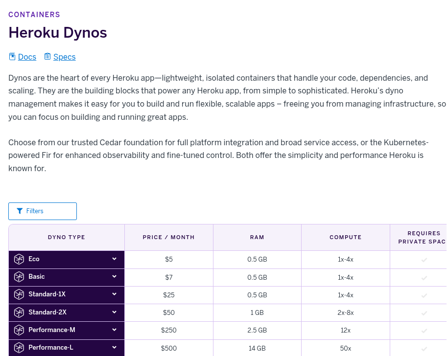
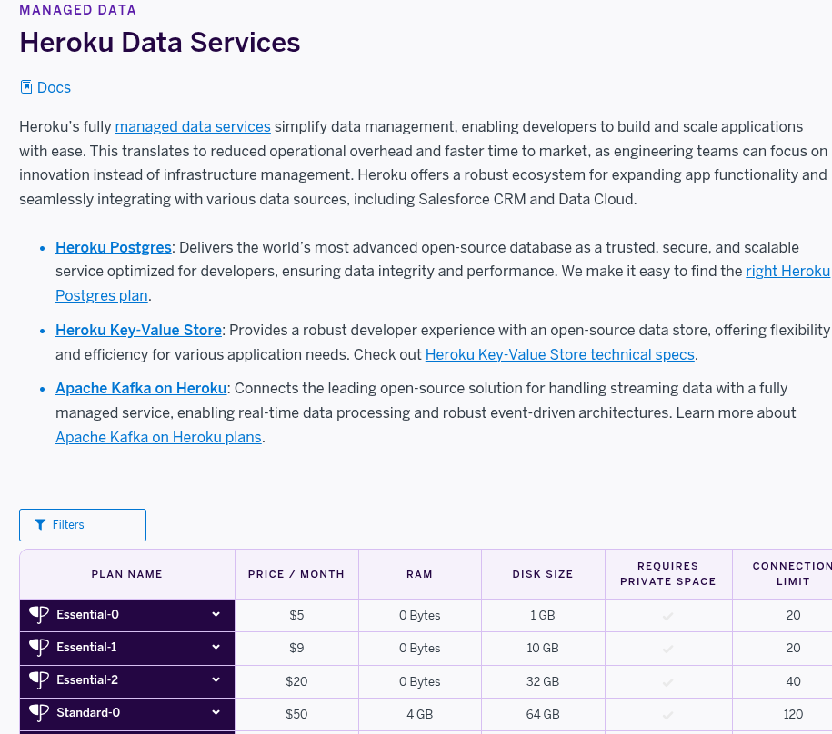

#### Gewählte Heroku Komponenten:

**1. Web Dyno - Standard 1X**

- **Spezifikationen:** 512 MB RAM
- **Features:**
  - Automatisches Scaling
  - SSL-Zertifikate inkludiert
  - Automatische Restarts
- **Kosten:** $25/Monat

**2. Heroku Postgres - Standard-0**

- **Spezifikationen:**
  - 64 GB Storage
  - 4 GB RAM Cache
  - Bis zu 120 Connections
- **Features:**
  - Automatische Backups (täglich)
  - Continuous Protection (4 Tage Rollback)
  - High Availability
  - Automatic Health Checks
- **Kosten:** $50/Monat

**Gesamtkosten Heroku:** **$75 pro Monat** ($900 pro Jahr)

#### Erklärung der Komponentenwahl Heroku:

**Standard 1X Dyno (Web Server):**
Ein Standard 1X Dyno mit 512 MB RAM klingt erstmal wenig im Vergleich zu unseren 2 GB On-Premise. Aber: Heroku Dynos sind hochoptimiert und teilen sich keine Ressourcen mit anderen Applikationen. Außerdem kann man bei Bedarf automatisch mehrere Dynos starten (Horizontal Scaling). Für 30 Benutzer ist ein Dyno völlig ausreichend, bei mehr Last kann man problemlos auf 2-3 Dynos hochskalieren.

**Standard-0 Postgres Datenbank:**
Die Standard-0 Datenbank ist ein Managed Service - das bedeutet, Heroku kümmert sich um alles: Updates, Backups, Monitoring, Security Patches. Die 64 GB Storage sind für unsere Produktivdaten ausreichend (On-Premise haben wir 100 GB, aber da sind auch die Backups dabei). Der große Vorteil: Die Continuous Protection erlaubt es uns, die Datenbank innerhalb von 4 Tagen auf jeden beliebigen Zeitpunkt zurückzusetzen - ohne dass wir selbst Backup-Skripte schreiben müssen.

**Backup-Strategie:**
Bei Heroku müssen wir uns um Backups nicht mehr kümmern - das übernimmt der Managed Service automatisch. Tägliche Backups sind inkludiert, und durch die Continuous Protection haben wir sogar mehr Flexibilität als mit unserer On-Premise Lösung.

**Abweichungen zur On-Premise Infrastruktur:**

- **Web Server RAM drastisch reduziert:** 2 GB → 512 MB (Heroku Dynos sind effizienter, Container-basiert)
- **DB Storage reduziert:** 100 GB → 64 GB (nur Produktivdaten, keine Backups mehr auf demselben Storage)
- **Backup-Management komplett automatisiert:** Keine manuellen Backup-Skripte mehr nötig
- **Wartung entfällt:** Keine OS-Updates, keine Security Patches, keine Monitoring-Konfiguration
- **Deployment vereinfacht:** Git-Push für neue Versionen

**Vorteile von PaaS:**

- Kein DevOps-Team nötig für Infrastruktur-Management
- Automatisches Scaling bei Bedarf
- Sehr schnelles Deployment (Minuten statt Stunden)
- Entwickler können sich auf Code konzentrieren statt auf Server-Verwaltung

**Nachteile von PaaS:**

- Weniger Kontrolle über die Infrastruktur
- Vendor Lock-in (Heroku-spezifische Features)
- Höhere Kosten pro Monat als IaaS (aber niedrigere Total Cost of Ownership durch eingesparte Arbeitszeit)

---

## Teil C: SaaS - Repurchasing

### Zoho CRM

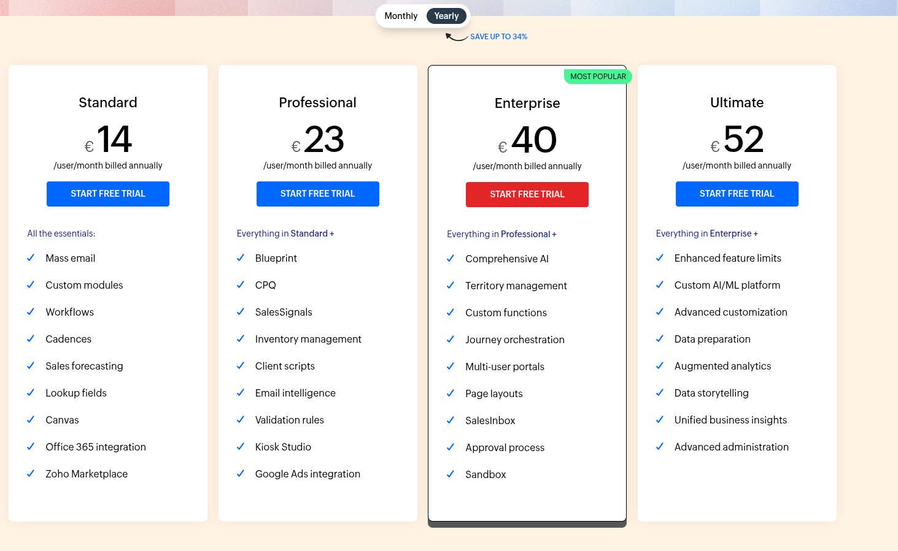
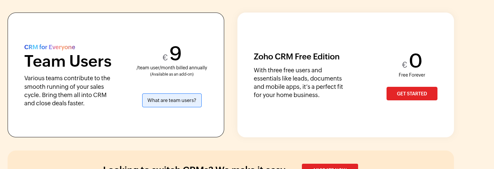

#### Zoho CRM Pricing-Optionen:

| Plan             | Preis pro User/Monat | Features                                         |
| ---------------- | -------------------- | ------------------------------------------------ |
| **Standard**     | €14                  | Basic CRM, Sales Forecasting, Reports            |
| **Professional** | €20                  | + Workflow Automation, Custom Modules, Inventory |
| **Enterprise**   | €35                  | + Advanced Analytics, Territory Management       |
| **Ultimate**     | €45                  | + Advanced BI, Feature dev sandbox               |

**Empfohlene Konfiguration:**

- **Plan:** Professional Edition
- **Anzahl User:** 30
- **Monatliche Kosten:** 30 × €20 = **€600/Monat**
- **Jährliche Kosten:** **€7,200/Jahr** (ca. $7,800)

#### Begründung für Professional Edition:

Die Professional Edition bietet das beste Preis-Leistungs-Verhältnis für unsere Anforderungen:

**Warum Professional und nicht Standard?**

- Workflow-Automatisierung ist wichtig für Effizienz (z.B. automatische Lead-Zuweisung)
- Custom Modules erlauben Anpassungen an unsere spezifischen Prozesse
- Inventory Management könnte relevant sein, falls wir Produkte verwalten
- Der Aufpreis von €6/User ist gerechtfertigt durch die zusätzlichen Features

**Warum nicht Enterprise oder Ultimate?**

- Enterprise-Features wie Territory Management brauchen wir nicht (nur 30 User)
- Advanced BI und Analytics sind nice-to-have, aber nicht kritisch
- Der Preissprung auf €35-45/User ist zu hoch für unsere Bedürfnisse
- Ultimate mit €45/User ist fast doppelt so teuer wie Professional

---

### Salesforce Sales Cloud

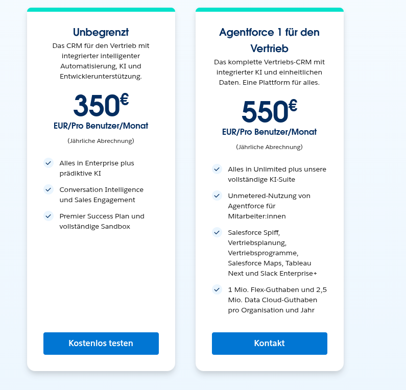
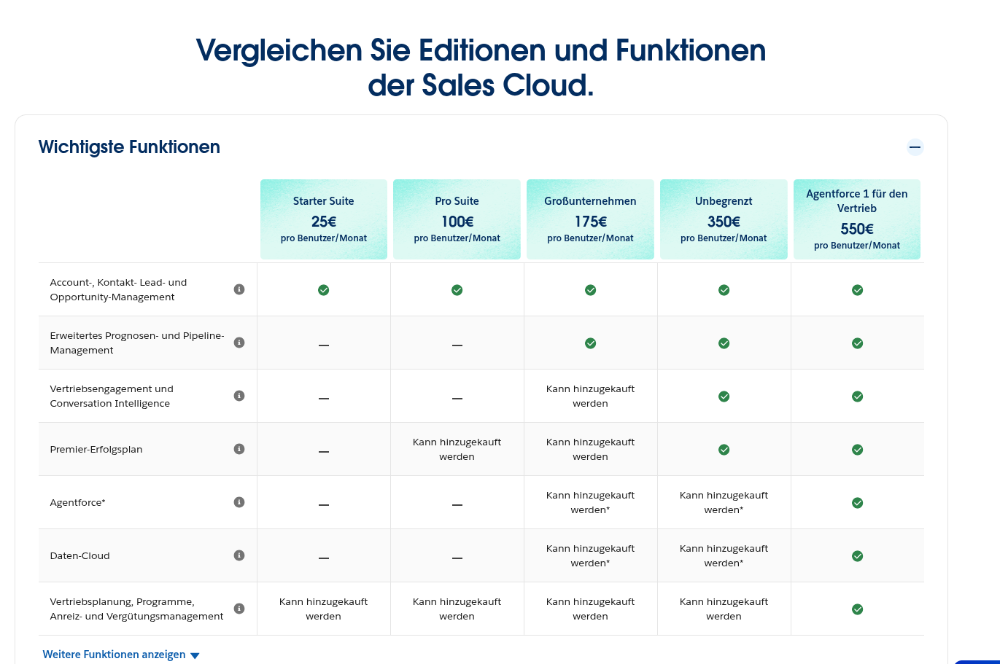

#### Salesforce Sales Cloud Pricing-Optionen:

| Plan             | Preis pro User/Monat | Features                                   |
| ---------------- | -------------------- | ------------------------------------------ |
| **Essentials**   | $25                  | Basic CRM, max. 10 User                    |
| **Professional** | $80                  | Complete CRM, API Access, Reports          |
| **Enterprise**   | $165                 | Advanced Customization, Advanced Analytics |
| **Unlimited**    | $330                 | Unlimited everything, 24/7 Support         |

**Empfohlene Konfiguration:**

- **Plan:** Professional Edition
- **Anzahl User:** 30
- **Monatliche Kosten:** 30 × $80 = **$2,400/Monat**
- **Jährliche Kosten:** **$28,800/Jahr**

#### Begründung für Professional Edition:

**Warum nicht Essentials?**

- Essentials ist auf maximal 10 User limitiert - wir haben 30 User
- Essentials ist damit automatisch ausgeschlossen

**Warum Professional?**

- Komplett anpassbares CRM-System
- API-Zugriff ist wichtig (falls wir Integrationen mit anderen Systemen brauchen)
- Erweiterte Reports und Dashboards
- Opportunity Management für Sales-Prozesse
- Lead Scoring für bessere Priorisierung
- Ausreichend für die meisten mittelständischen Unternehmen

**Warum nicht Enterprise oder Unlimited?**

- Enterprise kostet $165/User - mehr als doppelt so teuer wie Professional
- Für 30 User wären das $4,950/Monat statt $2,400 - zu teuer
- Enterprise-Features wie Advanced Customization und Workflow Approval brauchen wir nicht unbedingt
- Unlimited mit $330/User ist völlig überdimensioniert für unsere Bedürfnisse ($9,900/Monat!)

**Hinweis zu Salesforce:**
Salesforce ist der Marktführer bei CRM-Systemen und bietet die umfangreichsten Features. Allerdings ist es auch mit Abstand die teuerste Lösung. Die Professional Edition bei Salesforce kostet 4x mehr als die Professional Edition bei Zoho CRM.

---

## Teil D: Interpretation der Resultate

### Kostenvergleich Übersicht

| Variante            | Monatlich    | Jährlich         | Rang (günstig → teuer) |
| ------------------- | ------------ | ---------------- | ---------------------- |
| **AWS IaaS**        | $57          | $684             | 1️⃣                     |
| **Azure IaaS**      | $80          | $960             | 2️⃣                     |
| **Heroku PaaS**     | $75          | $900             | 3️⃣                     |
| **Zoho SaaS**       | €600 (~$650) | €7,200 (~$7,800) | 4️⃣                     |
| **Salesforce SaaS** | $2,400       | $28,800          | 5️⃣                     |

#### Kostenanalyse im Detail

**Warum sind die Kosten so unterschiedlich?**

Die enormen Preisunterschiede (Faktor 42 zwischen AWS und Salesforce!) erklären sich durch die unterschiedlichen Service-Levels:

**1. IaaS (AWS/Azure) - Niedrigste Cloud-Kosten:**

- Wir bezahlen nur für virtuelle Maschinen und Storage
- Alles andere (Installation, Konfiguration, Wartung) machen wir selbst
- Wie ein leeres Grundstück - wir müssen das Haus selbst bauen

**2. PaaS (Heroku) - Mittleres Feld:**

- Wir bezahlen für eine Plattform, auf der unsere Applikation läuft
- Infrastruktur-Management wird übernommen
- Updates, Backups, Scaling sind automatisiert
- Wie eine Mietwohnung - Infrastruktur vorhanden, wir bringen nur unsere Möbel (Code)

**3. SaaS (Zoho/Salesforce) - Höchste Kosten:**

- Wir bezahlen pro Benutzer für eine fertige Software
- Keine eigene Entwicklung oder Wartung nötig
- Alles ist fertig konfiguriert und sofort nutzbar
- Wie ein Hotel - alles inklusive, wir bringen nur unsere Koffer (Daten)

**Sind diese Unterschiede gerechtfertigt?**

**Ja, wenn man die versteckten Kosten berücksichtigt:**

Die reinen Cloud-Kosten sind nur ein Teil der Gesamtkosten (Total Cost of Ownership = TCO).

---

### Nicht berücksichtigte Kosten (Hidden Costs)

#### Bei IaaS (AWS/Azure) - Zusätzlich ca. $2,000-3,000/Monat

**Infrastruktur-Zusatzkosten:**

- Data Transfer Out (Traffic ins Internet): ca. $50-100/Monat
- Load Balancer für Hochverfügbarkeit: ca. $20-30/Monat
- SSL-Zertifikate: ca. $10-50/Jahr
- Monitoring & Logging (CloudWatch/Azure Monitor): ca. $30-50/Monat
- Backup-Automation-Tools: ca. $20/Monat

**Personal-Kosten (der größte Posten!):**

- **DevOps/System Administrator:** 0.5-1 FTE (Full Time Equivalent)
  - Aufgaben: Server-Verwaltung, Updates, Security Patches, Monitoring
  - Kosten: ca. $4,000-6,000/Monat (Schweizer Gehalt)
- **Bei 50% Auslastung:** ca. $2,000-3,000/Monat

**Zeitaufwand für:**

- Initiale Migration und Setup: 3-4 Wochen
- OS-Updates (monatlich): 4-8 Stunden
- Security Patches (bei Bedarf): 2-4 Stunden
- Backup-Testing (quartalsweise): 8 Stunden
- Incident Response: unplanbar

**Realistische IaaS-Gesamtkosten:** $2,057-3,057/Monat

---

#### Bei PaaS (Heroku) - Zusätzlich ca. $500-800/Monat

**Infrastruktur-Zusatzkosten:**

- Monitoring Add-ons (z.B. New Relic): ca. $25-50/Monat
- SSL-Zertifikate: oft inkludiert
- Logging Add-ons: ca. $10-20/Monat

**Personal-Kosten (deutlich geringer!):**

- **Developer/DevOps:** 0.2-0.3 FTE
  - Aufgaben: Deployments, Monitoring, App-Wartung
  - Keine Server-Administration nötig!
  - Kosten: ca. $800-1,200/Monat

**Zeitaufwand für:**

- Initiale Migration: 2-3 Wochen (Code-Anpassungen)
- Deployments: Minuten statt Stunden
- Monitoring: Dashboard vorhanden
- Updates: Automatisch durch Heroku

**Realistische PaaS-Gesamtkosten:** $875-1,075/Monat

---

#### Bei SaaS (Zoho/Salesforce) - Zusätzlich ca. $200-500/Monat

**Einmalige Kosten:**

- Daten-Migration: $2,000-5,000 (einmalig)
- Initial Setup & Customization: $1,000-3,000 (einmalig)
- User Training: $1,000-2,000 (einmalig)

**Laufende Zusatzkosten:**

- Support & Maintenance Contracts: oft schon inkludiert
- Zusätzliche Features/Add-ons: $50-200/Monat
- External Consultants (bei Anpassungen): $200-500/Monat

**Personal-Kosten (minimal!):**

- **CRM Administrator:** 0.1 FTE (Teilzeit)
  - Aufgaben: User-Verwaltung, Reports, Anpassungen
  - Keine technischen Skills nötig
  - Kosten: ca. $400-600/Monat

**Zeitaufwand für:**

- Initiale Migration: 4-6 Wochen
- Laufende Verwaltung: 1-2 Stunden/Woche
- User-Support: 2-4 Stunden/Woche

**Realistische SaaS-Gesamtkosten (Zoho):** €600 + $400-600 = ca. $1,050-1,250/Monat  
**Realistische SaaS-Gesamtkosten (Salesforce):** $2,400 + $400-600 = ca. $2,800-3,000/Monat

---

### Total Cost of Ownership (TCO) - 3 Jahre

Jetzt vergleichen wir die **realistischen Gesamtkosten** über 3 Jahre:

| Variante            | Monatlich (real) | 3 Jahre Total      | TCO Ranking       |
| ------------------- | ---------------- | ------------------ | ----------------- |
| **Heroku PaaS**     | $875-1,075       | **$31,500-38,700** | 1️⃣ **Best Value** |
| **Zoho SaaS**       | $1,050-1,250     | $37,800-45,000     | 2️⃣                |
| **AWS IaaS**        | $2,057-3,057     | $74,052-110,052    | 3️⃣                |
| **Azure IaaS**      | $2,080-3,080     | $74,880-110,880    | 4️⃣                |
| **Salesforce SaaS** | $2,800-3,000     | $100,800-108,000   | 5️⃣                |

**Überraschende Erkenntnis:**

- AWS sieht mit $684/Jahr super günstig aus
- ABER: Mit Personal-Kosten wird es plötzlich zu einer der teuersten Varianten!
- Heroku und Zoho sind plötzlich die wirtschaftlichsten Lösungen

**Warum ist Heroku Best Value?**

1. Niedrige Cloud-Kosten ($900/Jahr)
2. Minimaler Personal-Aufwand (nur 0.2 FTE statt 0.5-1 FTE)
3. Schnelle Time-to-Market
4. Wir behalten unsere eigene Software (Flexibilität)
5. Einfache Skalierung bei Wachstum

---

### Aufwand für die Firma

#### AWS/Azure IaaS - Rehosting

**Migrations-Aufwand: Hoch (3-4 Wochen)**

**Initiale Migration:**

1. **Woche 1-2: Infrastruktur-Setup**

   - VPC/Virtual Network erstellen
   - Security Groups/Firewall Rules konfigurieren
   - EC2/VM Instances erstellen
   - Storage konfigurieren
   - Backup-Automatisierung implementieren

2. **Woche 3: Applikation installieren**

   - Web-Server installieren (Apache/Nginx)
   - Datenbank installieren (MySQL/PostgreSQL)
   - Applikation deployen
   - Konfiguration anpassen

3. **Woche 4: Testing & Go-Live**
   - Funktions-Tests
   - Performance-Tests
   - Daten-Migration
   - DNS-Umstellung
   - Rollback-Plan testen

**Benötigte Skills:**

- Cloud-Architektur (AWS/Azure)
- Linux System Administration
- Networking (VPN, Firewall, Load Balancer)
- Security Best Practices
- Backup & Disaster Recovery

**Laufender Aufwand: Hoch (0.5-1 FTE)**

**Wöchentliche Aufgaben:**

- Monitoring prüfen (2-3 Stunden/Woche)
- Log-Analyse bei Problemen (1-2 Stunden/Woche)
- Support bei User-Problemen (2-4 Stunden/Woche)

**Monatliche Aufgaben:**

- Security Patches installieren (4-8 Stunden/Monat)
- OS-Updates (4-6 Stunden/Monat)
- Backup-Tests durchführen (2-4 Stunden/Monat)
- Performance-Optimierung (2-4 Stunden/Monat)

**Quartalsweise/Jährlich:**

- Disaster Recovery Tests (8-16 Stunden/Quartal)
- Security Audits (16-24 Stunden/Jahr)
- Kosten-Optimierung (4-8 Stunden/Quartal)

**Risiken:**

- Single Point of Failure (wenn nur 1 Admin)
- Fehler bei Updates können System lahmlegen
- Security-Lücken bei verspäteten Patches

---

#### Heroku PaaS - Replattforming

**Migrations-Aufwand: Mittel (2-3 Wochen)**

**Initiale Migration:**

1. **Woche 1: Code-Anpassungen**

   - Applikation für 12-Factor-App umbauen
   - Environment Variables statt Config-Files
   - Database-Credentials aus ENV lesen
   - Static Files auf CDN auslagern (optional)

2. **Woche 2: Deployment-Setup**

   - Heroku App erstellen
   - Postgres Datenbank erstellen
   - Git Repository verbinden
   - CI/CD Pipeline konfigurieren
   - Add-ons konfigurieren (Monitoring, Logging)

3. **Woche 3: Testing & Go-Live**
   - Staging-Environment testen
   - Daten-Migration
   - Performance-Tests
   - DNS-Umstellung
   - Go-Live

**Benötigte Skills:**

- Applikations-Entwicklung (Ruby/Python/Node.js/Java)
- Git Workflow
- Verständnis von Environment Variables
- Grundlegendes Database-Know-how
